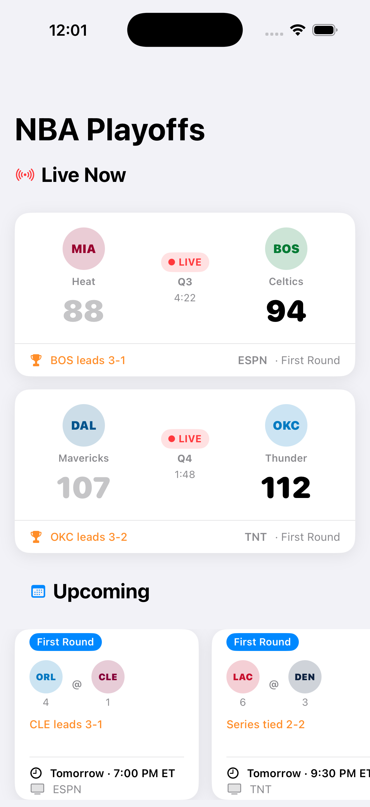
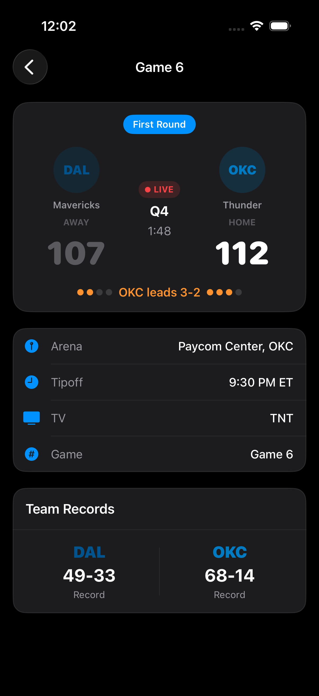
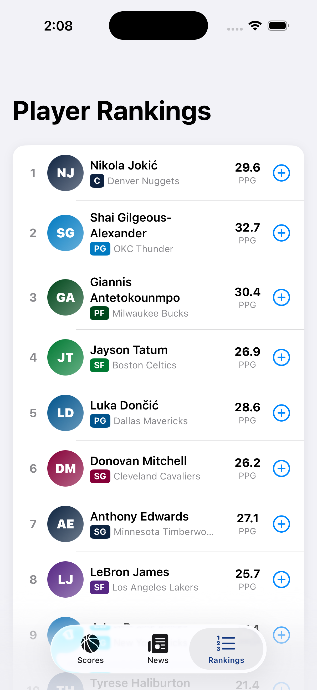

# 🏀 BuzzerBeater — Real-Time NBA Scores (SwiftUI)

A modern iOS app for tracking live NBA playoff games, built with SwiftUI.
Focuses on real-time updates, clean UI, and production-style architecture.

---

## 🚀 Overview

BuzzerBeater displays:

* 🔴 Live games with real-time scores, quarter, and game clock
* 📅 Upcoming games with schedules and broadcast info
* 🏁 Completed games with final scores and series context

The app is designed to mimic a production sports experience with smooth UI updates and clear game state separation.

---

## 🧱 Tech Stack

* **SwiftUI** — declarative UI and layout
* **NavigationStack** — modern navigation architecture
* **MVVM-style state management** via `NBAStore`
* **Async data handling** (designed for real-time updates)
* Custom reusable components for cards and UI elements

---

## ✨ Key Features

### 🔴 Live Game Tracking

* Real-time score display
* Quarter + game clock updates
* Visual “LIVE” indicator with animation
* Winning team emphasis

### 📅 Upcoming Games

* Horizontal scrolling schedule
* Broadcast + tip-off time
* Series context

### 🏁 Completed Games

* Final scores with winner highlighting
* Series tracking and game numbers

### 🎨 UI/UX Focus

* Clean, card-based layout
* Smooth scrolling + navigation
* Reusable SwiftUI components
* Dynamic team color theming

---

## 🧠 Architecture Notes

* Structured using a **store-driven approach** (`NBAStore`) to manage game state
* Views are **modular and composable** (e.g., `LiveGameCard`, `UpcomingGameCard`)
* Separation between:

  * Data (models/store)
  * UI components
  * Navigation

Designed to be easily extended with:

* WebSocket-based live updates
* API integration
* Caching/offline support

---

## 📸 Screenshots

  
  
 

---

## 🔧 Future Improvements

* Real-time updates via WebSockets
* Team detail pages
* Push notifications for game events
* Offline caching / persistence
* Advanced stats and player data

---

## 💡 Why I Built This

I wanted to build a realistic, production-style SwiftUI app that reflects the kind of real-time mobile systems I’ve worked on professionally—focusing on performance, clarity, and maintainable architecture.

---

## ▶️ Running the Project

1. Clone the repo
2. Open in Xcode
3. Build & run on simulator

---

## 📬 Contact

Feel free to reach out if you’d like to chat about the project or iOS development.
